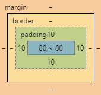
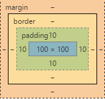

#极客学院的CSS3教程

* [文字阴影](#textshadow)

* [加载字体](#fontfamily)

* [选择器](#choose)

* [兄弟元素选择器](#brother)

* [内联和块元素](#inlineblock)

* [display表格显示](#list-item)

* [盒子中文字显示不下](#overflow)

* [按钮点击效果](#buttonactive)

* [box-sizing属性](#box-sizing)

<a name="textshadow"></a>
##文字阴影
```js
    #fontid {
        /*(水平 垂直 模糊 阴影的颜色) 可以设置多个阴影*/
        text-shadow: -5px 5px 5px red;
        color: white;
        font-size: 40px;
        font-weight: bold;
        background-image: url(./img/myiconicon.jpg);
        height: 100px;
        width: 100px;
    }
```
```js
<div id="fontid">文字阴影</div>
```

<a name="fontfamily"></a>
##加载字体
```js
    @font-face {
        font-family: yumi;
        src: url(img/yumi.ttf)format("truetype");
    }
    #fontfamilyid {
        font-family: yumi;
    }
```
```js
<div id="fontfamilyid">加载远程或者本地的字体</div>
```

<a name="choose"></a>
##选择器
```js
    /*鼠标移到上面显示*/
    input[type="text"]:hover{
        background-color: violet;
    }
    /*光标获取焦点*/
    input[type="text"]:focus{
        background-color: #F3E9F5;
    }
    /*鼠标选中或者点击*/
    input[type="text"]:active{
        background-color: green;
    }
    /*选中checkbox*/
    input[type="checkbox"]:checked{
        outline: 2px solid gold;
    }
```
```js
<input type="text" name="name">
<input type="checkbox">阅读
```

<a name="brother"></a>
##兄弟元素选择器
```js
    /*div的兄弟元素为p的画，执行以下样式*/
    div ~ p {
        background-color: gold;
    }
```
```js
    <div>
        <div>
            <p>P元素为div的子元素</p>
            <p>P元素为div的子元素</p>
        </div>
        <p>P元素为div的子元素</p>
        <p>P元素为div的子元素</p>
        <p>P元素为div的子元素</p>
    </div>
```

<a name="inlineblock"></a>
##内联和块元素 display

>inline 内联元素 不可以设置宽高
>block 块元素 可以设置宽高
>inline-block 内联元素 可以设置宽高

```js
    .divinline {
        display: inline-block;
        width: 200px;
        background-color: red;
        color: white;
    }
    .spaninline {
        display: inline;
        background-color: blue;
        color: white;
    }
```
```js
    <div class="divinline">div内联和块元素</div>
    <div class="divinline">div内联和块元素</div>
    <p></p>
    <span class="spaninline">spa内联和块元素</span>
    <span class="spaninline">spa内联和块元素</span>
```

<a name="list-item"></a>
##内联和块元素 display

>inline 内联元素 不可以设置宽高
>block 块元素 可以设置宽高
>inline-block 内联元素 可以设置宽高

```js
    .divlist{
        display: list-item;
        list-style-type: circle;
        margin-left: 30px;
        border: 1px dashed #0EE67C;
        margin-top: 5px;
    }
```
```js
    <div class="divlist">div列表显示</div>
    <div class="divlist">div列表显示</div>
    <div class="divlist">div列表显示</div>
    <div class="divlist">div列表显示</div>
    <div class="divlist">div列表显示</div>
```

<a name="overflow"></a>
##对盒子容纳不下的内容的显示

>hidden  内容会被修剪，并且其余内容是不可见的。
>scroll  内容会被修剪，但是浏览器会显示滚动条以便查看其余的内容。
>auto    如果内容被修剪，则浏览器会显示滚动条以便查看其余的内容。

```js
{
    overflow: scroll;
    overflow-x: scroll;
    overflow-hidden: scroll;
    <!-- 文字不换行 -->
    white-space: nowrap;
}
```

<a name="buttonactive"></a>
##按钮点击效果

```js
    .boxbtn{
        box-shadow: 0 0 10px gray;
        width: 100px;
        color: green;
        font-size:16px;
    }
    .boxbtn:active{
        box-shadow: none;
        font-size:14px;
        background-color: gray;
    }
```
```js
<div class="boxbtn">这里是button</div>
```

<a name="box-sizing"></a>
##盒子实际的宽度和高度

左边是border-box, 右边是content-box




```js
    #contentid{
        background-color: green;
        box-sizing:content-box;
        height: 100px;
        width: 100px;
        padding: 10px;
    }
    #borderid{
        width: 100px;
        height: 100px;
        padding: 10px;
        background-color: blue;
        box-sizing:border-box;
    }
```
```js
    <div id="contentid">content-box</div>
    <div id="borderid">border-box</div>
```