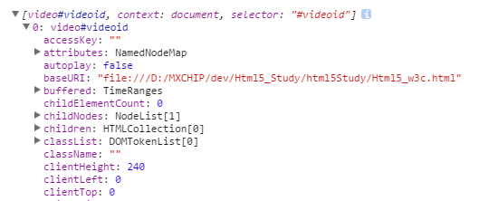

#Html5教程

2015-10-12
>[视频](http://www.w3school.com.cn/html5/html_5_video.asp)
>>video标签
```js
<video id="videoid" src="../../../../TempScene/profiles/mxchip.mp4" width="320" height="240" controls="controls">
    Your browser does not support the video tag.
</video>
<!--autoplay="autoplay" 视频加载成功后自动播放-->
<video id="videoid" width="320" height="240" controls="controls" autoplay="autoplay">
    <source src="../../../../TempScene/profiles/mxchip.mp4" type="video/mp4"> Your browser does not support the video tag.
</video>
```

>>控制video, 暂停pause()、播放play()、控制尺寸(myVideo.width = 560)

**如果用dom取可以直接取到，如果用jquery取需要用下标取[0]**, 因为获取到的是一个数组，具体见下图，也可以用 这个方法获取  **var myVideo = document.getElementById("videoid");** <br/>


```js
var myVideo1 = $("#videoid");
var myVideo = myVideo1[0];
function playPause() {
    console.debug(myVideo1);
    if (myVideo.paused)
        myVideo.play();
    else
        myVideo.pause();
}
function makeBig() {
    myVideo.width = 560;
}
```

>[HTML5Web存储](http://www.w3school.com.cn/html5/html_5_webstorage.asp)
>>localStorage
```js
function saveLocalStorage() {
    localStorage.loginame = "Rocke";
}
function showLocalStorage(){
    console.debug(localStorage.loginame);
}
function cleanLocalStorage() {
	localStorage.clear();
}
```
