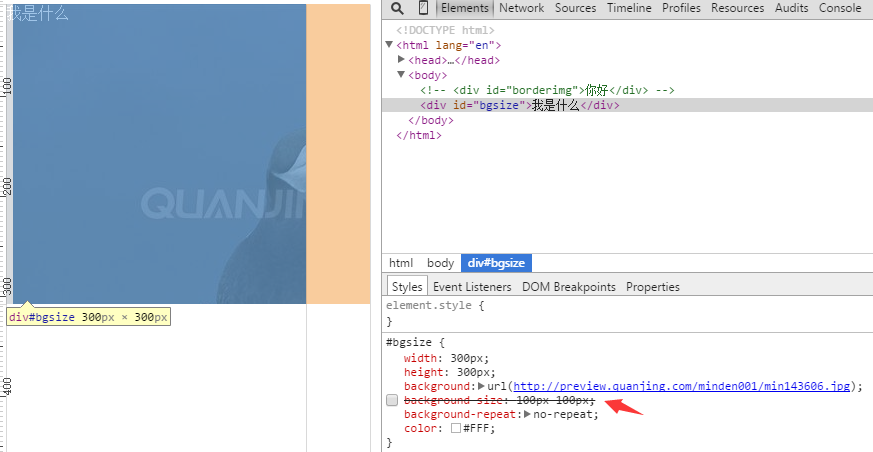
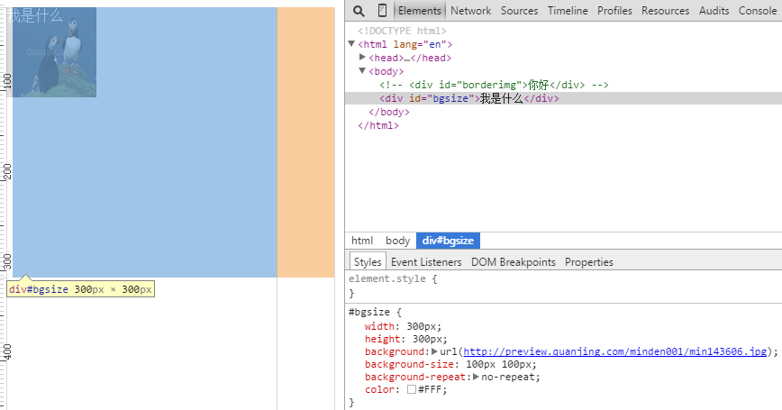

#Html5教程

2015-10-12
>[视频](http://www.w3school.com.cn/html5/html_5_video.asp)
>>video标签
```js
<video id="videoid" src="../../../../TempScene/profiles/mxchip.mp4" width="320" height="240" controls="controls">
    Your browser does not support the video tag.
</video>
<!--autoplay="autoplay" 视频加载成功后自动播放-->
<video id="videoid" width="320" height="240" controls="controls" autoplay="autoplay">
    <source src="../../../../TempScene/profiles/mxchip.mp4" type="video/mp4"> Your browser does not support the video tag.
</video>
```

>>控制video, 暂停pause()、播放play()、控制尺寸(myVideo.width = 560)

**如果用dom取可以直接取到(**var myVideo = document.getElementById("videoid");**)，如果用jquery取需要用下标取[0]**, 因为获取到的是一个数组，具体见下图:<br/>


```js
var myVideo1 = $("#videoid");
var myVideo = myVideo1[0];
function playPause() {
    console.debug(myVideo1);
    if (myVideo.paused)
        myVideo.play();
    else
        myVideo.pause();
}
function makeBig() {
    myVideo.width = 560;
}
```

>[HTML5Web存储](http://www.w3school.com.cn/html5/html_5_webstorage.asp)
>>localStorage
```js
function saveLocalStorage() {
    localStorage.loginame = "Rocke";
}
function showLocalStorage(){
    console.debug(localStorage.loginame);
}
function cleanLocalStorage() {
	localStorage.clear();
}
```

>[HTML5Web存储](http://www.w3school.com.cn/css3/css3_border.asp)
>>图片边框(border-image:url(border.png) 30 30 round;)
```js
border-image: url(http://www.w3school.com.cn/i/border.png) 10 10 round;
```

>[CSS3背景](http://www.w3school.com.cn/css3/css3_background.asp)
>>图片自动撑满整个background，无叠加

**重要** <span style="color:red;">background-size需要写在background下面</span> **重要**

有background-size的效果和无background-size的效果见下图<br/>
<br/>
<br/>

```js
    width: 300px;
    height: 300px;
	background:url(http://preview.quanjing.com/minden001/min143606.jpg);
	background-size:100px 100px;
	background-repeat:no-repeat;
	color: #FFF;
```

##--------------------------------华丽的分割线--------------------------------

#[CSS3 3D 转换](http://www.w3school.com.cn/css3/css3_3dtransform.asp)

>拉伸
```js
#transitionid {
    width: 100px;
    height: 100px;
    background: green;
    transition: width 1s;
    color: white;
}
#transitionid:hover {
    width: 300px;
}
```

>将动画绑定到选择器
```js
#transitionid {
    width: 100px;
    height: 100px;
    background: green;
    transition: width 1s;
    color: white;
    animation: myfirst 5s;
}
@keyframes myfirst {
    width: 300px;
    from {
        background: red;
    }
    to {
        background: yellow;
    }
}
```

>当动画完成时，会变回初始的样式
```js
@keyframes myfirst {
	0%   {background:red;}
	25%  {background:yellow;}
	50%  {background:blue;}
	100% {background:black;}
}
```

>画正方形动作
```js
#transitionid {
    animation: myfirst 5s;
    position:relative;
}
@keyframes myfirst {
	0%   {background:red;left:0px; top:0px;}
	25%  {background:yellow; left:200px; top:0px;}
	50%  {background:blue;left:200px; top:200px;}
	75%  {background:gray;left: 0px; top: 200px}
	100% {background:black;left:0px; top:0px;}
}
```

>[CSS3 多列](http://www.w3school.com.cn/css3/css3_multiple_columns.asp)
```js
-webkit-column-rule:3px outset blue;
-webkit-column-count:2; /* Safari and Chrome */
column-gap:30px;
```

#[header](https://css-tricks.com/almanac/properties/d/display/)
>顶部header左右平分，并悬浮于页面
```js
.containers {
    width: 100%;
    display: flex;
    flex-flow: row wrap;
    text-align: center;
    padding: 10px 0;
    background: #EFF1F5;
    position: fixed;
    z-index: 9999;
}
.left {
    flex: 1;
    background: #ECBABA;
}
.main {
    width: 60%;
    background: #ACDCD0;
}
.right {
    flex: 2;
    background: #ECBABA;
}
```
```js
    <header class="containers">
        <div class="left">左</div>
        <div class="main">中</div>
        <div class="right">右</div>
    </header>
    <p style="height:700px;background:green;opacity: 0.4;"></p>
```