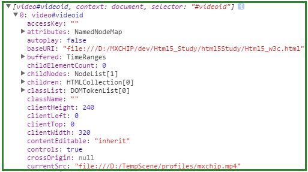

#Html5教程

2015-10-12
>[视频](http://www.w3school.com.cn/html5/html_5_video.asp)
>>video标签
```js
<video src="../../../../TempScene/profiles/mxchip.mp4" width="320" height="240" controls="controls">
    Your browser does not support the video tag.
</video>
<!--autoplay="autoplay" 视频加载成功后自动播放-->
<video width="320" height="240" controls="controls" autoplay="autoplay">
    <source src="../../../../TempScene/profiles/mxchip.mp4" type="video/mp4"> Your browser does not support the video tag.
</video>
```

>>控制video


```js
<video id="videoid" src="../../../../TempScene/profiles/mxchip.mp4" width="320" height="240" controls="controls">
    Your browser does not support the video tag.
</video>

//如果用dom取可以直接取到，如果用jquery取需要用下标取[0]
// var myVideo = document.getElementById("videoid");
var myVideo1 = $("#videoid");
var myVideo = myVideo1[0];

function playPause() {
    console.debug(myVideo1);
    if (myVideo.paused)
        myVideo.play();
    else
        myVideo.pause();
}

function makeBig() {
    myVideo.width = 560;
}

function makeSmall() {
    myVideo.width = 320;
}

function makeNormal() {
    myVideo.width = 420;
}
```

